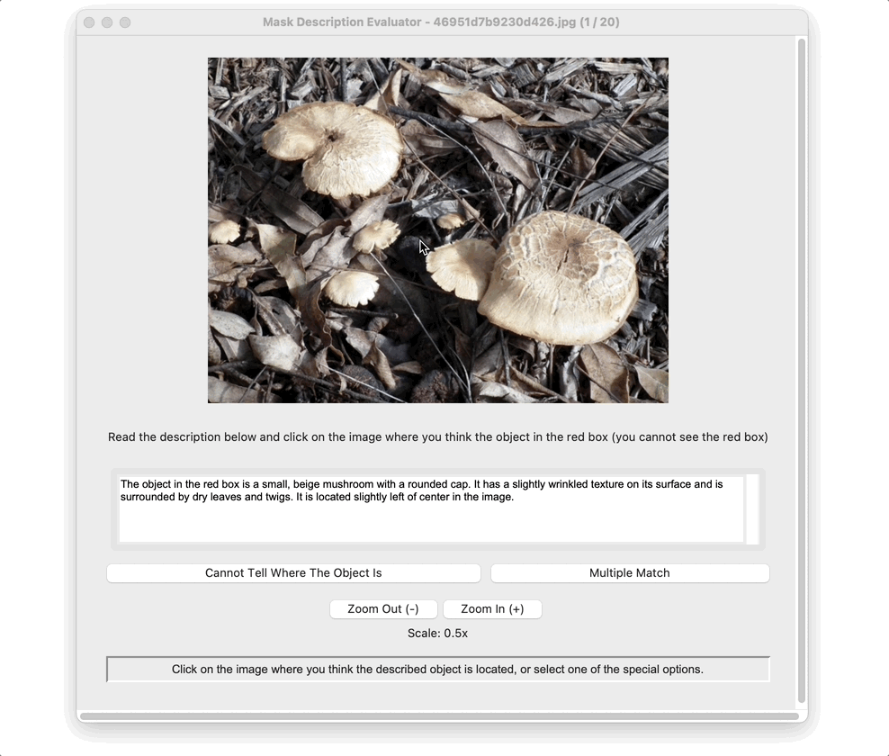
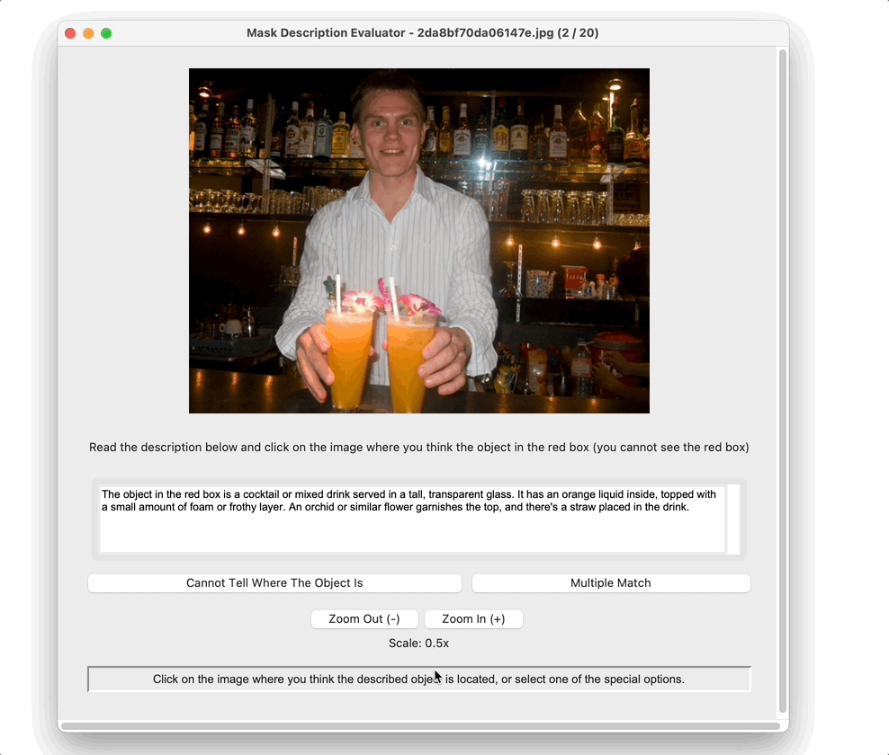
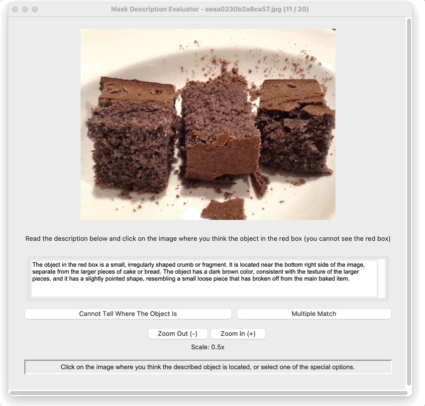
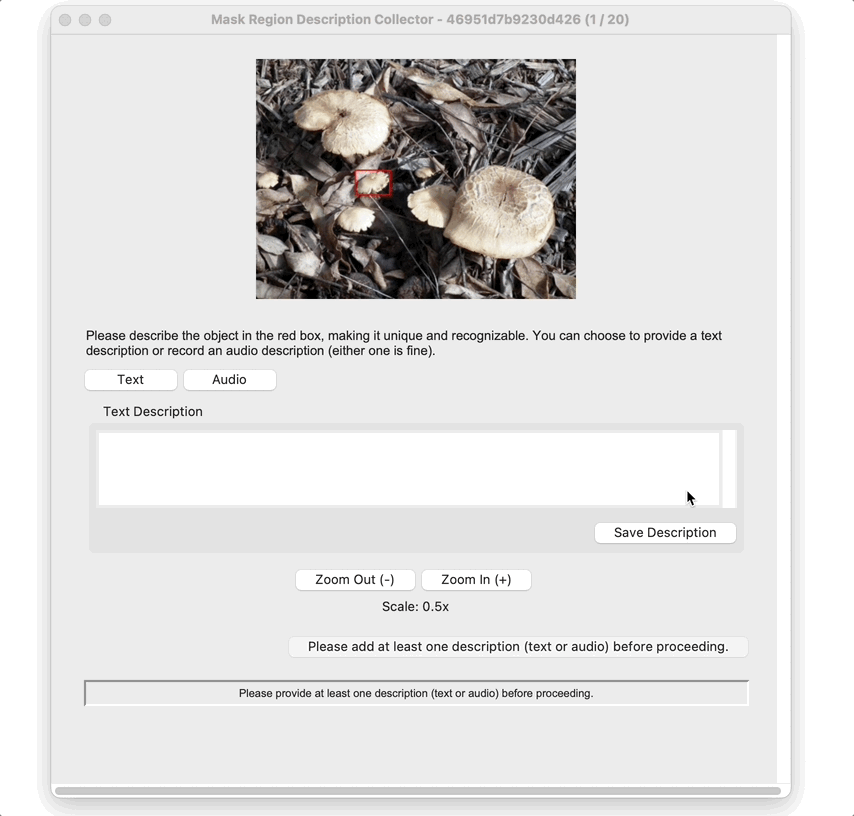

# PixRefer

## Precommit Setup
**This is for the author, you can skip this step.**


We use Google docstring format for our docstrings and the pre-commit library to check our code. To install pre-commit, run the following command:

```bash
conda install pre-commit  # or pip install pre-commit
pre-commit install
```

The pre-commit hooks will run automatically when you try to commit changes to the repository.


## Quickstart
**These tasks require a GUI, so it is recommended that you run it on a Mac / Windows.**
### Clone git repo
```bash
git clone https://github.com/Mars-tin/pixrefer.git
cd pixrefer
pip install -e .
```

### Install some packages
If you are using a Mac, run the following code to install PyAudio:
```bash
brew install portaudio
pip install pyaudio
```

Run the following code to install google-cloud-speech:
```bash
pip install google-cloud-speech
```

### Download the data
```bash
git lfs install
```

#### For REL and REG tasks
```bash
git clone https://huggingface.co/datasets/Seed42Lab/Pixrefer_data
```

If you have already download the data above and want to download the pragmatics preference data:
```bash
cd Pixrefer_data
mkdir pragmatic
git worktree add pragmatic pragmatics_preference
cd -
```

If you want to renew the data:
```bash 
cd Pixrefer_data
git pull origin main
cd -
```

#### For pragmatics preference task only
```bash
git clone -b pragmatics_preference https://huggingface.co/datasets/Seed42Lab/Pixrefer_data
```

If you want to renew the data:
```bash
cd Pixrefer_data/pragmatic
git pull origin pragmatics_preference
cd -
```

### Prepare the google key
Create empty .env file:
```bash
touch .env
```
And add the content below: 
`GOOGLE_API_KEY={YOUR_API_KEY}`
Please replace the key with the real api key provided.

### Launch the demo
#### REL task
```bash
bash pixrefer/interface/run_rel.sh
```
**Please note you need to change the JSON file path in this file first**: [run_rel.sh](pixrefer/interface/run_rel.sh)

Replace the following path with your given data path. For example, you may need to annotate the `llava_7b_concise_results.json`:
```bash
--json_path Pixrefer_data/data/rel_user_input/llava_7b_concise_results.json  # replace the example gpt_4o file path here
```
**Also replace the `output_dir` when you annotate another file, so that your results will not be overwritten:**
```bash
--output_dir output/user_rel/regular  # replace the example concise dir if you are annotating the regular data
```

For each image, you are required to click where you think the **unique** object in the red box (you cannot see it) is located. 
<div style="text-align: center;">
  
</div>

If you find multiple objects that match the description, click `Multiple Match` and confirm your guess.
<div style="text-align: center;">
  
</div>

If you cannot find such an object in the image, click `Cannot Tell Where The Object Is` and confirm your guess.
<div style="text-align: center;">
  
</div>

You can always use `Enter(Return)` on your keyboard to quickly confirm and go to the next image.


#### REG task
```bash
bash pixrefer/interface/run_reg.sh
```

For each image, you are required to give **at least one** description of the object in the red box to make it can be **uniquely identified** by another person.

Write a text description:
<div style="text-align: center;">
  
</div>
After you finish, please click `Save Description` to save your result and you will see a green 'Text ✓'.

Record an audio description:

*Please note that you need to set the google api key in the `.env` file to proceed.*

<div style="text-align: center;">
  
</div>

Click `Audio` to switch to the audio mode, and click `Start Recording` to record. When you finish, click `Stop Recording`. You can edit the translation words, and click `Save Description` to save the edited result.

You can always use `Enter(Return)` on your keyboard to quickly confirm and go to the next image.


#### Pragmatics Preference
```bash
bash pixrefer/interface/run_pragmatic.sh
```
**Please note you need to change the JSON file path in this file first**: [run_rel.sh](pixrefer/interface/run_pragmatic.sh)

Replace the following path with your given data path. For example, you may need to annotate the `user_6_allocation.json`:
```bash
--json_path Pixrefer_data/pragmatic/user_input/user_6_allocation.json  # replace the example user_1 file path here
```

For the task, select one of the following options to describe the object pointed by the arrow compared to the other one in the image. 

Please note: 
- Follow your first instinct.
- The options change orders for each image.
- The maximum number of images that can be annotated at a time is **25**. Once this limit is reached, please take a break for **at least 10 minutes** before continuing.
