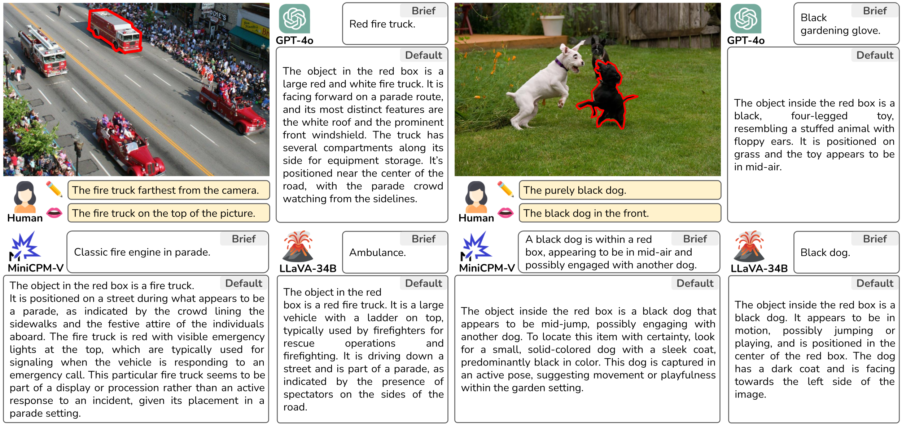
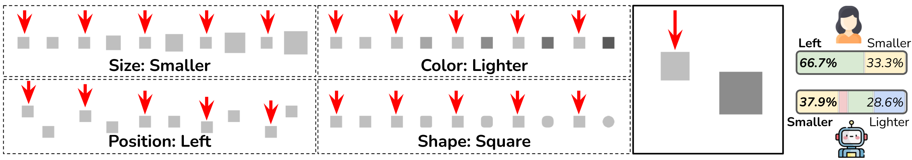
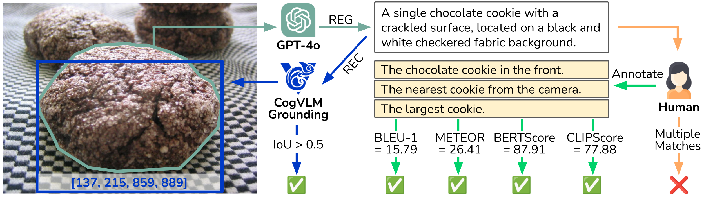

# 💬 VLM-REG: Vision-Language Models Are Not Pragmatically Competent in Referring Expression Generation

  

## Overview

We show how state-of-the-art Vision-Language Models (VLMs) fail at generating pragmatically competent referring expressions. While humans naturally produce concise, unambiguous references, VLMs:

- Fail to uniquely identify the target
- Include irrelevant or excessive details
- Ignore minimal but effective spatial cues

Given the limitations of existing datast, we also introduce **RefOI**, a new dataset built from OpenImages dataset with 1,500 real-world images and both **written and spoken** referring expression, divided by COCO and non-COCO class. Our evaluation shows clear misalignment between model output and human pragmatic behavior.

- Human written & spoken referring expressions
- COCO vs. non-COCO class distinctions
- Co-occurrence vs. no-cooccurrence distinctions

*Co-occurrence refers to the feature that an image contains more than one objects of the same class.* 

For token-level annotation of referring expressions, see the companion dataset **RefOI-TLHF**, which provides minimal span supervision for both human- and model-generated descriptions.

## Qualitative Example
We show a qualitative comparison of human and model referring expressions under Default and Brief prompts. Human expressions (especially in spoken form) tend to be concise and spatially grounded. In contrast, model outputs under Default prompts are often overly verbose, while Brief prompts reduce length but may omit pragmatically significant cues.

## Experiments

### Main Results: Discrepancy Between Automatic Metrics and Human Judgement
We compare multiple models across standard metrics, listener-based accuracy, and human judgment. Humans outperform all models by large margins (e.g., >90% vs. ~50%).

Automatic metrics such as BLEU and CIDEr show poor correlation with human judgment, frequently ranking verbose models higher. 

Even listener-based scores (REC) fail to consistently match human preferences, indicating that existing metrics do not capture pragmatic competence effectively.

| Model      | Instr. | BLEU-1 | BLEU-4 | ROUGE-1 | ROUGE-L | METEOR | CIDEr | SPICE | BERT  | CLIP  | REC   | Human | Irrel% |
|------------|--------|--------|--------|---------|---------|--------|-------|--------|--------|--------|--------|--------|--------|
| LLaVA-7B   | Dft.   | 13.27  | 1.60   | 18.09   | 16.30   | 19.29  | 2.10  | 10.50  | 85.51 | 79.02 | 17.28 | 39.46 | 87.30  |
|            | Brf.   | 28.74  | 6.05   | **36.46** | 35.50 | 19.15  | 10.80 | 24.59  | 89.02 | 70.72 | 13.58 | 30.57 | 41.95 |
| LLaVA-13B  | Dft.   | 8.17   | 1.07   | 11.98   | 10.94   | 16.89  | 0.77  | 7.92   | 84.61 | 79.85 | 15.27 | 46.40 | 91.85  |
|            | Brf.   | 28.96  | 5.81   | 36.44   | **35.64** | 20.13  | 8.14  | 21.63  | 88.42 | 72.99 | 15.33 | 32.53 | 49.65  |
| LLaVA-34B  | Dft.   | 6.29   | 0.78   | 9.82    | 9.11    | 16.15  | 0.07  | 7.61   | 84.39 | 79.86 | 16.21 | 46.53 | 92.90  |
|            | Brf.   | 28.55  | 6.38   | 32.99   | 31.67   | 20.48  | 9.60  | 16.50  | 88.50 | 74.95 | 17.22 | 36.77 | 56.11  |
| CogVLM     | Dft.   | 31.13  | **8.70** | 33.89 | 32.32   | 23.50  | **41.62** | 24.09 | 89.78 | 66.54 | 15.97 | 26.67 | **26.39**  |
|            | Brf.   | **31.39** | 8.69 | 34.70   | 32.94   | **24.87** | 41.41 | **24.74** | **90.00** | 69.15 | 18.06 | 33.53 | 29.88  |
| GLaMM      | Dft.   | 15.01  | 3.32   | 16.69   | 16.29   | 11.49  | 9.08  | 3.90   | 86.42 | 58.26 | 3.70  | 3.84  | 74.68  |
|            | Brf.   | 18.46  | 4.45   | 20.92   | 20.46   | 14.18  | 10.48 | 4.44   | 86.65 | 58.60 | 3.77  | 4.85  | 70.52  |
| XComposer  | Dft.   | 5.25   | 0.65   | 8.38    | 7.81    | 14.58  | 3.10  | 6.37   | 84.11 | 79.86 | 18.56 | 52.19 | 92.81  |
|            | Brf.   | 13.59  | 2.17   | 17.77   | 16.69   | 19.95  | 5.52  | 10.63  | 85.52 | 79.66 | 18.36 | 51.65 | 80.36  |
| MiniCPM-V  | Dft.   | 6.38   | 0.67   | 9.86    | 8.78    | 15.28  | 0.05  | 6.30   | 84.29 | 80.38 | 19.10 | 45.12 | 92.97  |
|            | Brf.   | 16.03  | 3.15   | 19.56   | 18.19   | 18.77  | 6.36  | 11.16  | 86.29 | 78.55 | 17.15 | 45.79 | 72.87  |
| GPT-4o     | Dft.   | 7.47   | 0.85   | 11.61   | 10.43   | 17.39  | 0.03  | 7.21   | 84.57 | **80.81** | **21.65** | **59.80** | 89.81  |
|            | Brf.   | 25.30  | 5.78   | 28.76   | 27.36   | 19.02  | 8.17  | 15.31  | 88.11 | 76.58 | 19.03 | 51.72 | 52.75  |
| Human      | Spk.   | 66.18  | 22.58  | 70.15   | 66.45   | 48.28  | 112.04 | 42.35 | 93.89 | 71.60 | 30.46 | 92.20 | 9.15   |
|            | Wrt.   | -      | -      | -       | -       | -      | -     | -      | -     | 70.43 | 30.06 | 89.29 | 7.29   |

Model performance under different <strong>Instr.</strong> (Instruction) settings: <strong>Dft.</strong> (Default) prompt and <strong>Brf.</strong> (Brief) prompt. All model predictions are evaluated against Human <strong>Wrt.</strong> (Written) results as the reference texts. We also compute Human <strong>Spk.</strong> (Spoken) data in comparison with human-written data. <strong>Irrel%</strong> refers to the percentage of irrelevant words in the referring expression of the examples evaluated as successful.

### Main Results Breakdown: Failures in Uniqueness and Identifiability
The breakdown below shows that many failures stem from referential ambiguity, particularly when multiple similar objects appear in the same scene.

Models often fail to generate uniquely identifying expressions under such conditions. 

Performance also drops significantly for non-COCO classes, suggesting dataset bias and poor generalization beyond common benchmarks.
        
All models struggle with images containing co-occurring objects, indicating limited ability to leverage distinctive features for disambiguation.

| Model      | Instr. | Human | REC   | Agree | Wrong% | Multi.% | No-Mat% | COCO  | No-COCO | ΔAcc     | Coocc. | No-Coocc. | ΔAcc     |
|-----------|--------|--------|--------|--------|--------|--------|----------|--------|----------|----------|--------|------------|----------|
| LLaVA-7B  | Dft.   | 39.46  | 17.28  | 65.23  | 14.62  | 40.40  | 5.52     | 41.26  | 37.65    | **-3.61** | 18.63  | 81.50      | **-62.87** |
|           | Brf.   | 30.57  | 13.58  | 72.02  | 10.23  | 52.26  | 6.94     | 31.18  | 29.96    | **-1.22** | 10.37  | 71.34      | **-60.97** |
| LLaVA-13B | Dft.   | 46.40  | 15.27  | 61.80  | 26.26  | 26.20  | 1.14     | 45.70  | 47.10    | 1.40     | 28.80  | 81.91      | **-53.11** |
|           | Brf.   | 32.53  | 15.33  | 70.01  | 10.30  | 56.63  | 0.54     | 33.47  | 31.58    | **-1.89** | 10.67  | 76.63      | **-65.96** |
| LLaVA-34B | Dft.   | 46.53  | 16.21  | 59.31  | 18.72  | 31.52  | 3.23     | 48.25  | 44.80    | **-3.45** | 29.41  | 81.10      | **-51.69** |
|           | Brf.   | 36.77  | 17.22  | 65.57  | 7.34   | 51.45  | 4.44     | 38.04  | 35.49    | **-2.55** | 15.11  | 80.59      | **-65.48** |
| CogVLM    | Dft.   | 26.67  | 15.97  | 68.65  | 2.89   | 47.34  | 23.10    | 27.96  | 25.37    | **-2.59** | 13.39  | 53.46      | **-40.07** |
|           | Brf.   | 33.53  | 18.06  | 61.59  | 2.96   | 52.53  | 10.98    | 34.81  | 32.25    | **-2.56** | 16.72  | 67.48      | **-50.76** |
| ...       | ...    | ...    | ...    | ...    | ...    | ...    | ...      | ...    | ...      | ...      | ...    | ...        | ...      |
| Human     | Spk.   | 92.20  | 30.46  | 35.04  | 6.93   | 0.74   | 0.13     | 92.07  | 92.58    | 0.51     | 91.74  | 93.50      | **-1.76**  |
|           | Wrt.   | 89.29  | 30.06  | 36.18  | 7.68   | 2.36   | 0.67     | 89.52  | 89.07    | **-0.45** | 88.31  | 91.26      | **-2.95**  |

<strong>Listener Compare:</strong> The human evaluation accuracy with <strong>REC</strong> (the evaluation result from CogVLM-Grounding) and computes <strong>Agree</strong> (the agreement between the two listeners).  
        <strong>Error Breakdown:</strong> The percentages of three types of errors: <strong>Wrong</strong> refers to a failed guess, <strong>Multi.</strong> refers to multiple potential matches, and <strong>No-Mat</strong> refers to cases where no object can be located.  
        <strong>Class Breakdown:</strong> The accuracy of COCO-class objects with non-COCO-class objects. The metric <strong>ΔAcc</strong> shows the accuracy drop between the two categories.  
        <strong>Class Co-occurrence:</strong> The accuracy of <strong>Coocc.</strong> images (images containing more than one object of the same class) with <strong>No-Coocc.</strong> images (images containing only one object of its class). ΔAcc denotes the accuracy drop between these two categories.

## Further Analyses and Discussions
### Synthetic Analysis: What Do Models Prefer?
While humans heavily rely on <strong>spatial cues</strong> in referring expressions, VLMs often favor <strong>combinations of visual attributes</strong> such as shape and color. This divergence reveals that VLMs may not follow human pragmatic preferences when multiple minimal descriptions are available—violating Gricean maxims of <em>Relation</em> and <em>Quantity</em>.

To isolate this effect, we design a synthetic dataset to test whether models prefer spatial, size, shape, or color attributes when all are equally valid. The results reveal that:

- Humans strongly prefer spatial descriptors.
- VLMs show scattered, non-pragmatic preferences.

### Why Current Evaluation Metrics Are Broken?

Current evaluation metrics fail to reward pragmatic success. For instance, "cookie" and "big cookie" may both get high scores even if only one is pragmatically appropriate.

This highlight the <strong>urgent need for pragmatically aware evaluation frameworks</strong> that reflect human-like judgments.

